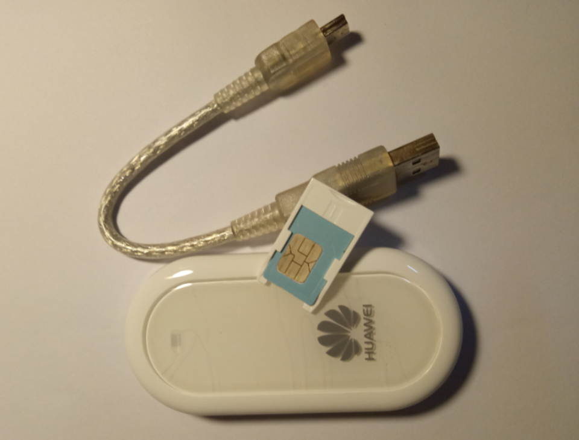

使用树莓派通过短信更新饭否
==============================

这是 `短信饭 <https://m.setq.me/apps/sms>`_ 的源码，简单修改即可搭建属于自己的服务。

如果你只是想使用而不是搭建它，请访问 `短信饭 - 使用帮助 <https://m.setq.me/apps/sms/help>`_ 。

所需硬件
------------

 - 树莓派 * 1
 - 支持短信模式的 USB 上网终端 * 1
 - 号码卡 * 1

下图是我所用的 USB 上网终端，华为 E220，35 元购于闲鱼：

测试环境
------------

树莓派 3B， Raspbian GNU/Linux 9，Python 2.7 & 3.5

安装依赖
------------

.. code-block:: bash

   pip install fanfou
   pip install pyserial

修改配置
------------

修改 raspi_sms.py 中的 consumer、username 和 password 为你自己的，修改 phone 为你想监听的手机号码。

因为树莓派中的号码卡可能会收到各种短信，当短信发件人为指定号码才更新饭否，更新内容为你给树莓派号码发送的短信。

运行
-------

.. code-block:: bash

   python raspi_sms.py

致谢
------

感谢阅读，如有疑问请联系我 `@home2 <https://fanfou.com/home2>`_ 。
